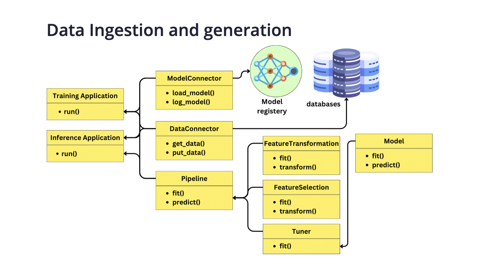

# Exploration Data Analysis

The goal of AutoML is to train models without prior knowledge about a new dataset. While this is theoretically possible, it is often more efficient to tailor the pipeline for specific problem classes or model paradigms. Therefore, it is crucial to understand the problem and study the data before diving into coding. Initial exploration data analysis (EDA) can be performed in a Jupyter notebook, for example, with the following goals:

1. Understanding the Data: Gain an initial understanding of the dataset, including the number of features, their data types, and examining the first few rows of the dataset.

2. Identifying Data Quality Issues: Look for missing values, outliers, duplicate data, and inconsistent data formats that may require cleaning or transformation.

3. Discovering Patterns and Anomalies: Analyze patterns, trends, correlations, and anomalies in the data. This includes understanding relationships between variables, identifying unusual distributions, and detecting any anomalies that might indicate data quality issues or require special treatment in modeling.

4. Testing Assumptions: Validate assumptions or hypotheses about the data, such as assumptions about distributions, relationships between variables, or the expected behavior of certain variables.

5. Informing Feature Engineering: Identify opportunities for creating new features that might improve model performance. This could involve combining existing features, creating categorical bins, or generating polynomial features.

6. Preparing for Data Preprocessing and Cleaning: Decide on strategies for dealing with missing values, encoding categorical variables, scaling or normalizing features, and handling outliers.

7. Choosing Appropriate Models: Gain insights into which types of models might be most effective given the characteristics of the data. For instance, certain patterns or correlations might suggest the usefulness of linear models, decision trees, or neural networks.

8. Establishing a Benchmark: Set a baseline for model performance. This could be as simple as the performance of a heuristic model or a basic statistical measure.

9. Guiding Model Selection and Validation Strategy: Inform decisions about how to split the data into training, validation, and test sets, and what validation strategies to use, such as cross-validation.

10. Visualizing Relationships: Use visualizations like scatter plots, histograms, and box plots to understand relationships between variables and the distribution of individual features.

# Feature Transformation

There are various feature transformations that you can explore:

1. Imputation of Missing Values: Modify the original information by dealing with missing values using techniques like sklearn.impute or autoimpute.

2. Normalization (Min-Max Scaling): Scale features to a fixed range, typically 0 to 1 or -1 to 1. Useful when features have different scales and algorithms are sensitive to variances in data, like neural networks or k-nearest neighbors.

3. Standardization (Z-Score Normalization): Rescale features to have a mean of 0 and a standard deviation of 1. Widely used in techniques that assume normally distributed data, like Support Vector Machines and Linear Regression.

4. Log Transformation: Reduce skewness in data, especially for right-skewed data. Helps stabilize variance and make the data conform more closely to a normal distribution.

5. Square Root Transformation: Another method to reduce right skewness, although less strong than log transformation.

6. Box-Cox Transformation: A generalized form of log transformation that can handle negative and zero values. Aims to stabilize variance and make the data more normal-like.

7. Yeo-Johnson Transformation: Similar to Box-Cox but can be applied to both positive and negative values.

8. Binning or Discretization: Convert continuous features into categorical features by creating bins or intervals. Useful for linear models and handling outliers.

9. One-Hot Encoding: Convert categorical variables into a form that can be provided to machine learning algorithms for better prediction. It creates a new binary column for each level/category of the feature.

10. Label Encoding: Assign a unique integer to each category based on alphabetical ordering. Useful when ordinal relationships exist in the categorical data.

11. Feature Hashing (Hashing Trick): A fast and space-efficient way of vectorizing features, particularly useful in high-dimensional data.

12. Principal Component Analysis (PCA): Used for dimensionality reduction while maintaining as much variance as possible.

13. Independent Component Analysis (ICA): Similar to PCA, it focuses on maximizing statistical independence of the variables.

14. Polynomial Features: Generate polynomial and interaction features. Useful in linear regression to model non-linear relationships.

15. Power Transformation: Includes general Box-Cox and Yeo-Johnson transformations, aiming to make data more Gaussian-like.

# Feature Selection

There are several ways to implement feature selection:

1. Correlation Matrix: Use a correlation matrix to check for multicollinearity and remove highly correlated features.

2. Chi-Squared Test: Select features based on their chi-squared statistics when dealing with categorical target variables.

3. ANOVA F-Test: Select features based on F-statistics when dealing with numerical input and categorical output.

4. Recursive Feature Elimination (RFE): Iteratively construct models and choose the best or worst-performing feature, setting it aside, and then repeating the process with the remaining features.

5. Sequential Feature Selection Algorithms: Include forward selection, backward elimination, and stepwise selection. These methods iteratively add or remove predictors and assess model performance.

6. Lasso Regression (L1 Regularization): Penalize the absolute size of coefficients, effectively shrinking some of them to zero, thus performing feature selection.

7. Feature Importance from Model: Use models like Random Forests, Gradient Boosting Machines (GBM), and XGBoost, which provide a feature importance score.

8. Permutation Importance: Assess the importance of a feature by calculating the increase in the model's prediction error after permuting the feature.

9. Boruta Algorithm: A wrapper built around the Random Forest classification algorithm, iteratively removing the least important features until all remaining features are deemed important.

10. Mutual Information: Measure the dependency between two variables and use it for both regression and classification problems to select features.

# Tuning Hyperparameters

There are many ways to tune hyperparameters, but I recommend considering the Bayesian Optimization HyperBand (BOHB) algorithm. BOHB is implemented in packages like Ray and SMAC3. It combines Bayesian optimization with successive halving to efficiently search the hyperparameter space and find optimal configurations.

